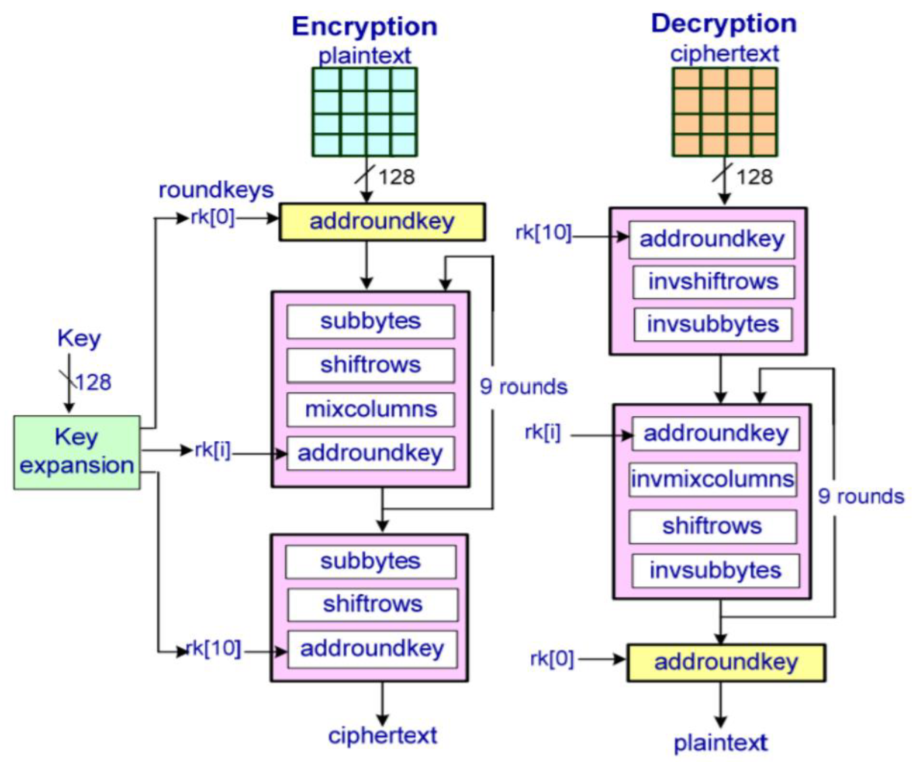
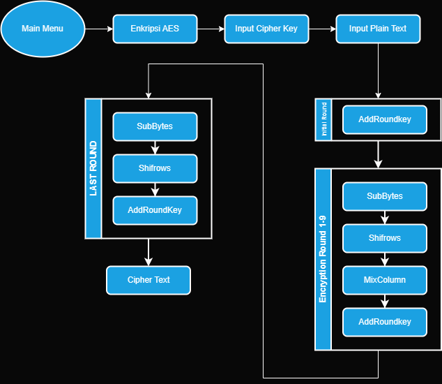

# Proyek 2 - Pengembangan Aplikasi Berbasis Library

Enkripsi AES dan LSB

## Daftar Isi
  * [Informasi Umum](#informasi-umum)
  * [Teknologi](#teknologi)
  * [Petunjuk Instalasi](#petunjuk-instalasi)
  * [Struktur/Hirarki Program](#strukturhirarki-program)
  * [Algoritma Advanced Encryption Standard(AES)](#algoritma-advanced-encryption-standard-aes)
  * [Fitur Aplikasi](#fitur-aplikasi)
  * [About Us](#about-us)
  * [Sumber](#sumber-referensi)

## Informasi Umum

Disini kami mencoba mengembangkan sebuah program keamanan melalui teknik kriptografi dan steganografi. Sistem keamanan ini dikembangkan sebagai syarat untuk memenuhi tugas Proyek 2. Kami menggabungkan Advanced Encryption Standard (AES) untuk mengenkripsi data dan metode Least Significant Bit (LSB) untuk menyembunyikan data dalam gambar.

PENGERTIAN AES
Advanced Encryption Standard (AES) merupakan algoritma cryptographic yang dapat digunkan untuk mengamakan data. Algoritma AES adalah blok chipertext simetrik yang dapat mengenkripsi (encipher) dan dekripsi (decipher) informasi. Enkripsi merubah data yang tidak dapat lagi dibaca disebut ciphertext; sebaliknya dekripsi adalah merubah ciphertext data menjadi bentuk semula yang kita kenal sebagai plaintext. Algoritma AES is mengunkan kunci kriptografi 128, 192, dan 256 bits untuk mengenkrip dan dekrip data pada blok 128 bits.

PENGERTIAN STEGANOGRAFI
Steganografi adalah ilmu yang melibatkan komunikasi data rahasia dalam sebuah media, misalnya file gambar, audio, dan video. Hal ini didasarkan pada asumsi bahwa jika rahasia mudah terlihat, maka mudah untuk dipecahkan, sehingga tujuan dari LSB di sini adalah untuk menyembunyikan keberadaan data yang disisipkan tanpa mudah diketahui orang lain.

STEGANOGRAFI GAMBAR LSB
Steganografi LSB adalah teknik steganografi gambar di mana pesan disembunyikan di dalam sebuah gambar dengan mengganti bit paling tidak signifikan (bit paling rendah/belakang) dari setiap piksel dengan bit dari pesan yang akan disembunyikan.
RGB (piksel 3x8-bit, warna asli) dan RGBA (piksel 4x8-bit, warna asli dengan transparansi). Nilai-nilai ini berkisar antara 0-255, (nilai 8-bit).

Representasi Gambar sebagai Piksel RGB
Kita dapat mengubah pesan menjadi nilai desimal dan kemudian menjadi biner, dengan menggunakan Tabel ASCII. Kemudian, kita mengulang nilai piksel satu per satu, setelah mengubahnya menjadi biner, kita mengganti setiap bit yang paling tidak signifikan dengan bit pesan tersebut secara berurutan.

Untuk memecahkan kode gambar yang disandikan, kita cukup membalikkan prosesnya. Kumpulkan dan simpan bit terakhir dari setiap piksel kemudian bagi menjadi kelompok 8 dan ubah kembali ke karakter ASCII untuk mendapatkan pesan yang disembunyikan.

## Teknologi

Proyek ini dibuat dengan :

- Bahasa Pemrograman : C++
- VSCODE Version : 1.84.2
- Dev-C Version : 4.9.2

## Petunjuk Instalasi

1. Download seluruh file yang tersedia di GitHub melalui link https://github.com/Cobalttt2311/Kelompok-B6
2. Download aplikasi compiler bahasa C ( disarankan menggunakan Dev C++ )
3. Import seluruh file yang telah diunduh ke aplikasi compiler bahasa C
4. Tambahkan proyek baru
5. Tambahkkan seluruh file yang telah diunduh ke dalam proyek

## Struktur/Hirarki Program

1. Diagram Alur Encrypt AES

## Algoritma Advanced Encryption Standard (AES)

Enkripsi Algoritma AES

CreateRoundKey :
Fungsi ini membuat dan mengambil 16 elemen dari expandedKey dan menyalin nya ke dalam block roundkey sesuai urutan dari initial round hingga round 10. Nantinya akan menghasilkan roundkey dari kunci yang diperluas.
Dengan menggunakan fungsi ini, kita dapat membuat round key yang unik untuk setiap ronde enkripsi, yang kemudian digunakan untuk melakukan operasi enkripsi pada blok teks.

AddRoundKey :
Addroundkey adalah proses XOR (eksklusif OR) antara setiap byte dalam blok data dengan kunci putaran (round key) yang telah dikembangkan sebelumnya. 
Addroundkey ini diterapkan pada
1. Initial Round, melakukan proses XOR antara Plaintext, dan Key yang diinput oleh user, sehingga menghasilkan blok baru untuk proses enkripsi
2. Proses Enkripsi dari Round 1 - 10

Sub Byte :
mengambil Nilai bit awal dan bit akhir untuk dijadikan index penunjuk sbox
lalu mensubtitusikan / menukar nilai yang dikirim(state) dengan sbox

ShiftRows :
memanipulasi baris-baris dalam matriks state dengan cara menggeser setiap baris 
ke kiri dengan jumlah posisi yang berbeda-beda.

MixColumn :
Mix Column adalah mengalikan tiap elemen dari blok chiper dengan matriks transformasi.

Pembangkit kunci : 
Prosedur yang menghasilkan kunci enkripsi, pembangkit kunci ini melibatkan 3 proses
1. Rotasi(RotWord), setiap karakter dalam kata kunci dipindahkan ke posisi sebelumnya dalam array, dengan karakter pertama dipindahkan ke posisi terakhir.
2. Substitusi (SubWord), melakukan substitusi pada setiap karakter dalam kata kunci dengan nilai yang sesuai dari tabel S-Box.
3. XOR, melakukan XOR karakter dengan tabel Rcon

## Fitur Aplikasi

Kriptografi

1. Enkripsi plainteks menggunakan metode AES
2. Dekripsi chiperteks menggunakan metode AES
   Steganografi
3. Menyisipkan sebuah pesan ke dalam gambar menggunakan metode LSB
4. Dekripsi sebuah gambar menjadi sebuah pesan menggunakan metode LSB

## About Us

Jurusan : Teknik Komputer dan Informatika

Prodi : D3 - Teknik Informatika

Kampus : Politeknik Negeri Bandung

Kelompok B6 :

    Anggota  :

      1. Alanna Tanisya Anwar (231511034) , alannatnsyaa

      2. Daffa Al Ghifari (231511038) , daffalghi

      3. Erina Dwi Yanti (231511043) , erinadwy

      4. Nalendra Praja Bredtyopati Yudo (231511056) , Cobalt2311

      5. Radja Restu Arsita (231511061) , Radja-Restu-A

    Manajer

      1. Djoko Cahyo Utomo Lieharyani, S.Kom., M.MT. (199312282019031013) , Lieharyani

## Sumber referensi

Aplikasi ini terinspirasi dari
https://github.com/m3y54m/aes-in-c
https://youtu.be/YpHJPvuCHNA?si=-fCSDrAgCLqRn0DO

Definisi AES :
https://kelas-ol.esaunggul.ac.id/pluginfile.php/232572/mod_forum/intro/Enkripsi%20Algoritma%20AES%20(Advanced%20Encryption%20Standard)%20PERTEMUAN%20KE%205.pdf?time=1585913179960

Definisi LSB :
https://medium.com/swlh/lsb-image-steganography-using-python-2bbbee2c69a2
